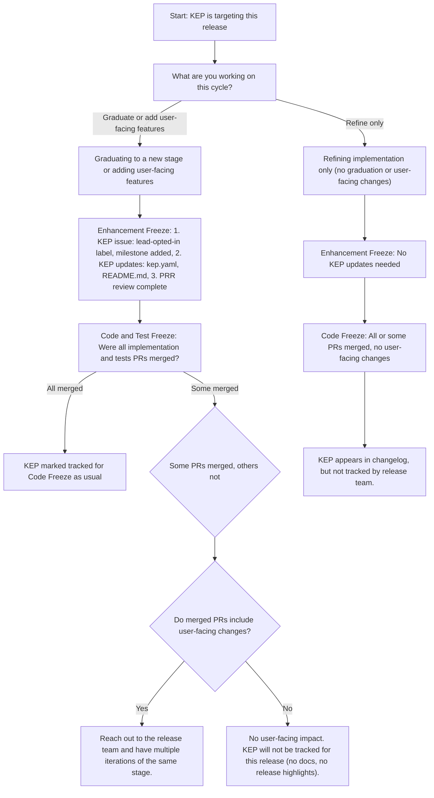

# Enhancements Lead Handbook

## Table of Contents

<!-- This only shows the top 2 levels of headings (## and ###) to prevent the TOC from getting too large. -->
- [Overview](#overview)
- [Responsibilities](#responsibilities)
- [Prerequisites](#prerequisites)
  - [General Requirements](#general-requirements)
  - [Enhancements-Specific Requirements](#enhancements-specific-requirements)
  - [Time Commitments](#time-commitments)
  - [Mentoring Shadows](#mentoring-shadows)
- [Getting Started](#getting-started)
  - [Access Required](#access-required)
  - [Slack](#slack)
- [Process](#process)
  - [Standards](#standards)
  - [PRR Reviews](#prr-reviews)
  - [Enhancement KEP Status](#enhancement-kep-status)
  - [What Changes Require Tracking](#what-changes-require-tracking)
  - [Working with the Release Tracking Board](#working-with-the-release-tracking-board)
  - [Pre-Freeze Check: Catching untracked feature changes](#pre-freeze-check-catching-untracked-feature-changes)
  - [Understanding Test Freeze](#understanding-test-freeze)
  - [Release Team Meeting Updates](#release-team-meeting-updates)
  - [Exceptions](#exceptions)
  - [Escalation / Handling Unresponsive Enhancement Owners](#escalation--handling-unresponsive-enhancement-owners)
  - [Limitations](#limitations)
- [Milestone Activities + Timing](#milestone-activities--timing)
  - [Week 0-1](#week-0-1)
  - [Week 1-2](#week-1-2)
  - [PRR Freeze Tasks](#prr-freeze-tasks)
  - [Enhancements Freeze Tasks](#enhancements-freeze-tasks)
  - [Code Freeze Tasks](#code-freeze-tasks)
  - [Communication Templates](#communication-templates)
  - [Before End Of Release](#before-end-of-release)

## Overview

While the Enhancements Lead serves as a member of the Release Team (a subproject of [SIG Release][sig-release]), this role is also a liaison to [sig-arch-Enhancements][sig-arch-enhancements] subproject of [SIG Architecture][sig-arch-readme].

## Responsibilities

An Enhancements Lead holds the following responsibilities:

- Maintain the active status of Enhancements within [kubernetes/enhancements][k/enhancements]
- Facilitate communication between Enhancement Owners, and SIG leadership, as necessary

- Assist in Communications activities (in conjunction with the Communications Lead & the CNCF Communications team):
  - Help collate the Release Highlights of the release, including but not limited to:
    - new enhancements
    - long-awaited enhancements
    - enhancements moving into GA
    - enhancement deprecations
    - notable changes to existing behaviors
  - Draft and/or review the https://kubernetes.io/blog/ release announcement post, leveraging the themes collected across the release cycle, e.g.:
    - [1.35 Announcement](https://kubernetes.io/blog/2025/12/17/kubernetes-v1-35-release/)
    - [1.34 Announcement](https://kubernetes.io/blog/2025/08/27/kubernetes-v1-34-release/)
  - Engage with media analysts during the embargo period to discuss the release themes
  - CNCF Kubernetes Release webinar (with the Release Lead and Communications Lead)
  - Identify potential contributors for the “5 Days of Kubernetes” blog series
- Identify candidates to assume the Enhancements Lead role (according to the [Release Team selection process](/release-team/release-team-selection.md)) in the following release cycle
  - Chose Enhancement shadows whom you believe would be a good fit for succession and help mentor them throughout the release cycle

## Prerequisites

### General Requirements

**Before continuing on to the Enhancements specific requirements listed below, please review and work through the tasks in the [Release Team Onboarding Guide](/release-team/release-team-onboarding.md).**

### Enhancements-Specific Requirements

Enhancements Lead:
- MUST have served on the Release Team in a previous capacity, ideally as an Enhancements Shadow
- MUST take the [Inclusive Speaker Orientation (LFC101)](https://training.linuxfoundation.org/training/inclusive-speaker-orientation/) training course

Helpful characteristics of an Enhancements Lead include:

- experience with the Kubernetes community, code layout, ecosystem projects, organizational norms, governance, SIG structure, architecture, and release process
- product/project/program management experience
- release management experience

### Time Commitments

Enhancements is one of the most time-intensive areas of the release team, and especially so during the early parts of the release. An Enhancements Lead can expect to spend:

- Beginning of the cycle through enhancement freeze: ~8–15 hours a week
- Week of enhancements freeze: 20+ hours
- Enhancement Freeze through Code Freeze: ~4–7 hours a week
- Code Freeze through Release Day: ~1–4 hours a week

Note that Enhancements Lead in particular will need to do work **during the week** during the early release, and will need to be available at least daily.

Enhancements shadows can expect to spend ~10–15 hours a week during the early release until enhancements freeze, and ~1–5 hours a week after enhancements freeze. Unlike Enhancements Lead, shadows can expect to do their work largely on weekends if they desire.

### Mentoring Shadows

The selected shadows should be:

- Interested in learning more about the Kubernetes release process.
- Able to dedicate a couple of hours each week to attending the Release meeting in addition to helping with weekly tasks.

The shadows should be selected keeping in mind that one of them may eventually be taking up the Enhancements Lead role. It is important to delegate tasks and give the shadows broad exposure to the different aspects of the role.

## Getting Started

### Access Required

Ensure that the previous Enhancements Lead has given you access to:

- The previous Kubernetes Release Tracking Board.

Ensure that you and the shadows are part of the [Kubernetes org](https://github.com/kubernetes/community/blob/main/community-membership.md#member) and have been added to:

- GitHub teams
  - [`enhancements`](https://github.com/orgs/kubernetes/teams/enhancements) (This group should be used for Enhancement Subproject related pinging only and not for Release Team Enhancements Group)
  - [`milestone-maintainers`](https://github.com/orgs/kubernetes/teams/milestone-maintainers)
  - [`release-team`](https://github.com/orgs/kubernetes/teams/release-team)
  - [`release-team-enhancements`](https://github.com/orgs/kubernetes/teams/release-team-enhancements) (For elevated access to tracking board)

- Google Groups
  - [`release-team`](https://groups.google.com/a/kubernetes.io/g/release-team)
  - [`release-team-shadows`](https://groups.google.com/a/kubernetes.io/g/release-team-shadows)
  - [`release-team-enhancements`](https://groups.google.com/a/kubernetes.io/g/release-team-enhancements)
  - [`kubernetes-sig-release`](https://groups.google.com/g/kubernetes-sig-release)
  - [`sig-architecture`](https://groups.google.com/a/kubernetes.io/g/sig-architecture)
  - [`dev`](https://groups.google.com/a/kubernetes.io/g/dev)

### Slack

Join the following Kubernetes Slack channels:

- [#sig-release](https://kubernetes.slack.com/messages/sig-release)
- [#enhancements](https://kubernetes.slack.com/messages/enhancements)
- [#release-enhancements](https://kubernetes.slack.com/messages/release-enhancements)
- (optional) [#prod-readiness](https://kubernetes.slack.com/messages/prod-readiness)
- (optional) [#release-management](https://kubernetes.slack.com/messages/release-management)

## Process

### Standards

As mentioned previously, the Enhancements Lead role encompasses several cross-functional responsibilities with [sig-arch-Enhancements][sig-arch-enhancements] subproject of [SIG Architecture][sig-arch-readme].

The process of maintaining an enhancement in Kubernetes is documented in the [kubernetes/enhancements][k/enhancements] repo. Any questions / concerns / suggestions for improvement to the Enhancements process should be raised as GitHub issues / PRs to k/enhancements.

It is important that this process be followed and documentation remain up-to-date as the [Enhancements repo][k/enhancements] is the primary ingress point for contributors interested in tracking enhancements.

### PRR Reviews

The KEP template production readiness questionnaire should be filled out by the KEP authors, and reviewed by the SIG leads.
Once the leads are satisfied with both the overall KEP (i.e., it is ready to move to `implementable` state) and the PRR answers,
the authors request a PRR approval. See [submitting a KEP for production readiness approval](https://github.com/kubernetes/community/blob/master/sig-architecture/production-readiness.md#submitting-a-kep-for-production-readiness-approval) for more details.

When should a KEP owner request for a new PRR?
1. When the KEP is ready to move to `implementable` state from `provisional`.
2. Everytime the KEP graduates to a new stage (`alpha`/`beta`/`stable`) the KEP needs a new PRR approval. If the KEP is graduating and is missing a section in the README that was not required for earlier stages (e.g. the scalability section is only required for `beta` or `stable`) it will need a new PRR review.
3. When there are major changes introduced in the responses of the PRR questionnaire in the KEP README.md file (this requires a new PRR review even if the KEP is staying in the same stage).

For example, the Enhancements team needs to check the KEP has PRR approval when:

**KEP graduates to `alpha`:**

```
# keps/prod-readiness/<name-of-the-sig>/1234.yaml
kep-number: 1234
alpha:
  approver: @<gh-handle-of-PRR-approver>
```

**KEP graduating from `alpha` -> `beta`**

```
# keps/prod-readiness/<name-of-the-sig>/1234.yaml
kep-number: 1234
alpha:
  approver: @<gh-handle-of-PRR-approver>
beta:
  approver: @<gh-handle-of-PRR-approver>
```

**and `beta` -> `stable`**

```
# keps/prod-readiness/<name-of-the-sig>/1234.yaml
kep-number: 1234
alpha:
  approver: @<gh-handle-of-PRR-approver>
beta:
  approver: @<gh-handle-of-PRR-approver>
stable:
  approver: @<gh-handle-of-PRR-approver>
```

#### PRR Freeze

See [PRR Freeze](/releases/release_phases.md#prr-freeze) for the definition and deadline details.

### Enhancement KEP Status

For each Enhancement KEP, the Enhancement team needs to verify that the `status` set in the KEP is one of `provisional`, `implementable`, `implemented`, `deferred`, `rejected`, `withdrawn`, or `replaced`.
The `status` must follow the criteria:

|        Status | Description                                                                                                                                                                                                         |
|--------------:|---------------------------------------------------------------------------------------------------------------------------------------------------------------------------------------------------------------------|
|   provisional | The KEP has been proposed and is actively being defined. This is the starting state while the KEP is being fleshed out and actively defined and discussed. The owning SIG has accepted that this work must be done. |
| implementable | Enhancement KEP should no longer have major changes and must be approved by each of the KEP approvers to enter `implementable`.                                                                                     |
|   implemented | Enhancement is graduating to`Stable`, code PRs are merged and feature flags have been removed. Once a feature has become `implemented`, major changes should get new KEPs.                                          |
|      deferred | Enhancement is proposed but not actively being worked on or the Enhancement has been bumped to a future release by owning SIG.                                                                                      |
|      rejected | The approvers and authors have decided that this KEP is not moving forward. The KEP is kept around as a historical document.                                                                                        |
|     withdrawn | Enhancement KEP authors have withdrawn the KEP and Enhancement will be removed from the code.                                                                                                                       |
|      replaced | The KEP has been replaced by a new KEP. The superseded-by metadata value should point to the new KEP.                                                                                                               |

See the sig-architecture Enhancements [KEP Template](https://github.com/kubernetes/enhancements/blob/master/keps/sig-architecture/0000-kep-process/README.md#kep-template) guide for a walkthrough of the metadata fields found in the KEP template.

### What Changes Require Tracking

A KEP may still be required to opt-in in order for the Enhancements subteam to monitor it, even if it is not graduating to a new stage.

**Changes that typically do NOT require tracking by the Release Team:**
- Improvements or refactors that do not affect behaviour (e.g., code cleanup, variable renaming, internal function reorganisation)
- Bug fixes that preserve functionality while restoring the intended behaviour

**Changes that typically DO require tracking by the Release Team:**
- Refactors or enhancements that affect behaviour (e.g., altering the functionality of a feature, modulating error handling, or changing performance characteristics)
- Any modifications that affect the user experience

The team will collaborate with the KEP authors to ensure that any outstanding exception request deadlines are met in the event that a KEP is discovered to contain modifications that should have been monitored.

Please contact SIG Release on Slack if there is any uncertainty regarding whether the planned action meets the threshold for required tracking.

### Working with the Release Tracking Board

The Release Tracking Board is used by the release-enhancements, release-docs, release-comms, and PRR teams.
Information in this document will be focused on how the Enhancements team should interact with the project board.

#### Enhancements View

The `Enhancements` view is the primary view for the project board and is owned by the Enhancements subteam.
This view is used source of truth for tracking the status of enhancements included in a given release.

> - **Do not** archive items from the board! Enhancements that are no longer being tracked for the current release are filtered out of the default View but should remain in the board for tracking purposes.

|                Field | Description                                                                       |
|---------------------:|-----------------------------------------------------------------------------------|
|                Title | Title of (and link to) the `Issue` in k/enhancements.                             |
|            Assignees | Assignees for the `Issue` in k/enhancements.                                      |
|                 Type | [Type](#type) of enhancement.                                                     |
|                Stage | Target stage (Alpha, Beta, Stable) for the current release.                       |
|               Status | [Status](#status) of the enhancement.                                             |
| Enhancements Contact | Alias of the Enhancements team designated as primary contact for the enhancement. |
|                  SIG | Owning SIG.                                                                       |
|           PRR Status | Status of PRR review for the enhancement.                                         |
|               Labels | Labels applied to the `Issue` in k/enhancements.                                  |
|            Milestone | The milestone assigned to the `Issue` in k/enhancements.                          |
|                 Note | Freeform notes added by the Enhancements team.                                    |

##### Type

|         Type | Description                                                                                                   |
|-------------:|---------------------------------------------------------------------------------------------------------------|
|      Net New | Enhancement is adding net-new work. Usually reserved for enhancements targeting their `Alpha` implementation. |
| Major Change | Enhancement is staying at the current Stage, but major changes in functionality are being implemented.        |
|   Graduating | Enhancement is graduating to `Beta` or `Stable`.                                                              |
|  Deprecation | Enhancement is tracking a deprecations or removals.                                                           |
|         Docs | This is a PR for Docs that is being tracked by Docs team.                                                     |
Notes :

- If the feature is graduating to `Alpha`, the type can either be Net New/Major Change. But usually when features are introduced to Kubernetes, they are not Major Changes.
- If the feature is graduating to `Beta/Stable`, almost always the type is Graduating/Major Change. One exception to that is some features directly jump the hoop to Beta, in that case, the type can be Net New for even a `Beta` feature.

##### Status

The field `Status` tracks if the KEP has met all the criteria for inclusion in the current release. The value of the column will change as we progress through the phases of the release cycle.

Refer to [Release Phases](/releases/release_phases.md) for detailed requirements for each release phase.

|                 Status | Description                                                                                                                                 |
|-----------------------:|---------------------------------------------------------------------------------------------------------------------------------------------|
|                Tracked For PRR Freeze | Enhancement has met all PRR Freeze requirements for inclusion into current release.                                                                    |
|                At Risk For PRR Freeze | Enhancement does not currently meet PRR Freeze requirements for inclusion into current release.
|                Tracked For Enhancement Freeze | Enhancement has met all Enhancements Freeze requirements for inclusion into current release.                                                                    |
|                At Risk For Enhancement Freeze | Enhancement does not currently meet Enhancements Freeze requirements for inclusion into current release.                                                        |
|                Tracked For Code Freeze | Enhancement has met all Code Freeze and Test Freeze requirements for inclusion into current release.                                                                    |
|                At Risk For Code Freeze | Enhancement does not currently meet Code Freeze and Test Freeze requirements for inclusion into current release. |
|                Tracked For Docs Freeze | Enhancement has met all Docs Freeze requirements for inclusion into current release.                                                                    |
|                At Risk For Docs Freeze | Enhancement does not currently meet Docs Freeze requirements for inclusion into current release. |
|     Exception Pending | Enhancement did not meet requirements for the current release phase, and an [exception](#exceptions) has been requested but not yet approved by the Release Team. |
|     Exception Approved | Enhancement did not meet requirements for the current release phase, and an [exception](#exceptions) has been requested and approved by the Release Team. |
|               Deferred | Enhancement has been bumped to a future release by owning SIG.                                                                              |
| Removed From Milestone | Enhancement did not meet requirements for one of the release phases and was removed from the milestone by the Release Team.  |

Notes:

- If the Enhancement is being bumped to a later release by the owning SIG, set its status to `Deferred`.
- If it is being removed due to missing criteria or lack of response after being included in the milestone, set its status to `Removed from Milestone`.

> Feel free to ask the previous enhancements leads about this when in doubt.

### Pre-Freeze Check: Catching untracked feature changes

As part of the Enhancements team’s responsibilities, this step helps ensure that user-facing feature changes are not merged without being properly tracked via a KEP.

#### When to check for untracked feature work

- Before **Code Freeze**
- Especially useful in active release cycles where many `kind/feature` PRs are being merged.

#### How to identify merged feature PRs for current release

Use the GitHub search below to list PRs:
- Labeled `kind/feature`
- Merged
- Targeting the **current release milestone**

Be sure to update the `{milestone}` in the query to the current release:
- `https://github.com/kubernetes/kubernetes/pulls?q=is%3Apr+milestone%3A{milestone}+is%3Amerged+sort%3Acreated-asc+label%3Akind%2Ffeature`
- Example query for v1.36: https://github.com/kubernetes/kubernetes/pulls?q=is%3Apr+milestone%3Av1.36+is%3Amerged+sort%3Acreated-asc+label%3Akind%2Ffeature

#### Why check for untracked user-facing features

In past releases, we've seen partial implementations get merged without being fully tracked. This can result in:
  - User-facing features with no docs or release notes.
  - Confusion during testing or upgrade planning.
  - Late-stage reversions or rushed exceptions.

By doing this simple check, we give ourselves an early window to document changes, request follow-ups, or even coordinate a rollback if needed.

#### Visual Flow: Handling partially merged KEPs
Use this decision flow to determine next steps when a KEP’s implementation is only partially complete at freeze time:


### Understanding Test Freeze

[Test Freeze](/releases/release_phases.md#test-freeze) occurs simultaneously with [Code Freeze](/releases/release_phases.md#code-freeze). For the Enhancements team, this means:

- **What it means**: No new tests may be changed or promoted to Conformance unless there are release-blocking or other exceptional reasons
- **For enhancements**: All test PRs related to tracked enhancements must be in a merge-ready state (with `approved` and `lgtm` labels) by the test freeze deadline
- **Verification steps**:
  - Ensure all test PRs for tracked enhancements are linked in the enhancement issue description
  - Verify test PRs have the required labels (`approved` and `lgtm`) applied
  - Check that test PRs are either merged or ready to merge by the deadline
- **Relationship to Code Freeze**: Both code freeze and test freeze requirements must be satisfied for an enhancement to be considered "Tracked for code freeze"

### Release Team Meeting Updates

Release team meeting attendance is mandatory for the Enhancements Lead and Shadows. Make sure that someone from the team is available at each meeting to give the status update, and that the Enhancements meeting notes are updated ahead of time.

The `status` is based on the following criteria:
- A `Red` on our enhancements status means that something major is blocking our work while tracking the enhancements. We hardly have a red status on our enhancements team.
- A `Yellow` status generally means that we are still in progress of tracking and reaching out to KEPs and owners, or we have some minor blockages but will be good as they will be resolved soon.
- A `Green` status means that everything looks good and done from enhancements team side, i.e. every KEP on the tracking board has been communicated with, done with the follow-ups, outreaches etc. Everything is A-OK here.

To get the KEP stats for the status update, use the `KEPs by Stage` and `KEPs by Status` insights from the tracking board. Examples from v1.36:
- [v1.36 KEPs by Stage](https://github.com/orgs/kubernetes/projects/241/insights/3)
- [v1.36 KEPs by Status](https://github.com/orgs/kubernetes/projects/241/insights/4)

### Exceptions

The exception process (criteria, deadlines, and what enhancement owners need to submit) is outlined in [releases/EXCEPTIONS.md](/releases/EXCEPTIONS.md).

Starting with the v1.36 release cycle, the Release Team tracks all exception requests on the [Release Tracking Board](#working-with-the-enhancement-tracking-board) using the `Exception Requests` view (e.g., [v1.36 Exception Requests view](https://github.com/orgs/kubernetes/projects/241/views/7)), instead of maintaining an `exceptions.yaml` file in the release directory.

#### Fields on the Exception Requests view

The `Exception Requests` view filters on `has:exception-request-type` and surfaces the following fields for each request:

|                          Field | Description                                                                                                                  |
|-------------------------------:|------------------------------------------------------------------------------------------------------------------------------|
|                          Title | Title of (and link to) the KEP `Issue` in k/enhancements. For additional exceptions on the same KEP, this is a draft item.   |
|                         Status | The KEP's current tracking status (e.g. `Tracked for PRR freeze`, `Removed from Milestone`).                                 |
|                            SIG | Owning SIG.                                                                                                                  |
|         Exception Request Type | The freeze the exception applies to: `PRR Freeze`, `Enhancements Freeze`, `Code and Test Freeze`, or `Docs Freeze`.          |
|               Exception Status | `In Review` while the Release Team is evaluating the request, then `Approved` or `Rejected` once a decision has been made.   |
|         Exception Request Link | Link to the Google Groups thread where the request was filed.                                                                |
|  Exception Request Slack Thread | Link to the corresponding `#sig-release` Slack thread.                                                              |
|          Exception Related PRs | Links to PRs associated with the exception (k/enhancements PRs for PRR/Enhancements Freeze, k/k PRs for Code/Test Freeze).   |
|                Additional Time | The additional time requested by the enhancement owner, in calendar days.                                                    |
|         Exception Request Date | Date (UTC) the exception was requested.                                                                                            |
|        Exception Decision Date | Date (UTC) the Release Team approved or rejected the exception.                                                                    |
|                Exception Liaison | The Release Team member (Enhancements Lead, Release Lead, or Release Lead shadow) assigned to follow up on the request.                                    |
|         Exception Request Notes | Notes from the assigned liaison about the request (context, follow-up items, links, etc.) that may be useful to the KEP owner or other Release Team members. |

#### Adding a new exception request

When an exception request email comes in:

1. **Locate the KEP in the `Enhancements` view** by searching for the KEP number.
    - If the KEP does not appear, it is likely being filtered out by the default view filter (e.g., `-status:Deferred,"Removed from Milestone" -enhancement-type:Docs`). Temporarily remove the relevant filter so the KEP becomes visible.
2. **Set the `Exception Request Type`** field on the KEP to the appropriate freeze (`PRR Freeze`, `Enhancements Freeze`, `Code and Test Freeze`, or `Docs Freeze`).
3. **Set the `Status` field on the `Enhancements` view to `Exception Pending`** to indicate the request is open and awaiting a Release Team decision.
4. As soon as `Exception Request Type` has a value, the KEP automatically appears in the `Exception Requests` view. Switch to that view, set `Exception Status` to `In Review`, and fill in the remaining fields (`Exception Request Link`, `Exception Request Slack Thread`, `Exception Related PRs`, `Additional Time`, `Exception Request Date`, etc.).
5. Assign the request to the Enhancements Lead, Release Lead or a Release Lead shadow via the `Exception Liaison` field for follow-up on the Slack thread.

##### Updating the KEP status through the exception lifecycle

As the request moves through the Release Team's decision and any follow-up work, keep both the `Exception Status` field (on the `Exception Requests` view) and the `Status` field (on the `Enhancements` view) in sync with reality:

- **While the Release Team is still evaluating the request**, leave `Exception Status` as `In Review` and the KEP `Status` as `Exception Pending`.
- **Once the Release Team has decided on the request**, populate `Exception Decision Date` and update both fields:
    - If **approved**: set `Exception Status` to `Approved` and the KEP `Status` to `Exception Approved`.
    - If **rejected**: set `Exception Status` to `Rejected` and the KEP `Status` to `Removed from Milestone` (see [Label and milestone updates](#label-and-milestone-updates-when-removing-or-re-adding-a-kep) below).
- **Once the deadline granted by the exception has passed**, re-evaluate the KEP and update its `Status` accordingly:
    - If the KEP has satisfied all the requirements for the freeze, move it to the appropriate `Tracked for ...` status (e.g. `Tracked for PRR freeze`, `Tracked for enhancements freeze`, `Tracked for code freeze`, `Tracked for docs freeze`). See [Label and milestone updates](#label-and-milestone-updates-when-removing-or-re-adding-a-kep) below for the corresponding label changes.
    - If the KEP missed the new deadline, set its `Status` to `Removed from Milestone`.

##### Label and milestone updates when removing or re-adding a KEP

Whenever the `Status` on the board transitions to or away from `Removed from Milestone`, also update the labels and milestone on the underlying k/enhancements issue so they stay consistent with the board.

- **When removing a KEP from the milestone** (e.g. exception rejected, or new deadline missed), comment on the issue with:
    ```
    /remove-label tracked/yes
    /label tracked/no
    /milestone clear
    ```
- **When adding a KEP back to the milestone as `Tracked for ...`** (e.g. exception approved and requirements subsequently met), comment on the issue with:
    ```
    /label tracked/yes
    /remove-label tracked/no
    /milestone {milestone}
    ```
    Replace `{milestone}` with the current release milestone, e.g. `v1.37`.

#### Handling multiple exceptions for the same KEP

GitHub Projects does not support multi-select on the `Exception Request Type` field, so a single KEP issue can only represent one exception type at a time. If the same KEP requests exceptions for multiple freezes, the KEP will already appear in the `Exception Requests` view (with the original freeze type) and cannot be re-added from the same issue.

To track an additional exception for a KEP that is already on the view:

1. In the `Exception Requests` view, click the `+` (add item) row at the bottom of the table and type the KEP name or number.
2. Select **Create a draft** from the dropdown.
3. Fill in `Exception Request Type` and the remaining columns for the additional exception just as you would for a regular item.

This keeps all exceptions for the KEP visible on the same view without requiring extra fields or separate views per freeze.

### Escalation / Handling Unresponsive Enhancement Owners

For issues where the initial owner is unresponsive, try escalating to the relevant SIG's leadership to determine if the issue is still targeted for the release.

If there is continued unresponsiveness on issues, remove them from the milestone at your discretion.

### Limitations

- Enhancements issues that are not submitted to [k/enhancements][k/enhancements] are not actively tracked in the context of the Release Team and Release cycle e.g.,
  - `kubeadm` (https://github.com/kubernetes/kubeadm/issues?utf8=%E2%9C%93&q=is%3Aissue+label%3Akind%2Ffeature+milestone%3Av1.12+)
  - out-of-tree Cloud Provider code that may live in `kubernetes-sigs/*`
  - additional out-of-tree code that may live in the following organizations:
    - `kubernetes`
    - `kubernetes-client`
    - `kubernetes-csi`
    - `kubernetes-incubator`
    - `kubernetes-sig-testing`
  - `kubernetes-sigs`
- Finding consensus on how frequently to triage enhancements

## Milestone Activities + Timing

### Week 0-1

#### Select enhancements shadows

- See [Mentoring Shadows](#mentoring-shadows) and [Release Team Shadows](/release-team/shadows.md) for details.
- Aim for a mixture of returning shadows with prior Enhancements experience (including those who might make good future leads), and shadows new to Enhancements or to the Release Team in general.
- Aim for a mixture of timezones to ensure adequate coverage for both the APAC and EMEA meetings.
- Since Enhancements has a lot of work to do at the beginning of the cycle, it is important to finalize shadows as soon as possible, ideally in the first few days once the shadow application closes.

#### Set up tracking board

- Make sure the previous tracking board has been cleaned up (this is usually done at the end of the previous cycle, but you should confirm again that everything is clean). See [End of Release Cleanup](./tracking-board.md#end-of-release-cleanup) for details.
- Follow the steps in [Setting Up New Tracking Board](./tracking-board.md#setting-up-new-tracking-board) to create the tracking board for the current release.
- Enable syncing of `lead-opted-in` issues to the new tracking board. See [Enabling Tracking Board Automation](./tracking-board.md#enabling-tracking-board-automation) for instructions.
- Use the [Opt-in Reminders](./tracking-board.md#opt-in-reminders) message template to remind SIGs to add the `lead-opted-in` label in order for issues to get added to the tracking board.

#### Update tracking board documentation

- Make the shortlink functional:
  - First, make sure a `links.md` file exists in the current release directory in [k/sig-release](https://github.com/kubernetes/sig-release). If the file doesn't exist yet, sync with the Release Lead to create it.
    - Example `links.md` from v1.36: https://github.com/kubernetes/sig-release/blob/master/releases/release-1.36/links.md
  - Make a pull request to [k/sig-release](https://github.com/kubernetes/sig-release) to add the tracking board link to `links.md`, under the `#enhancements` anchor.
    - Example PR from v1.36: https://github.com/kubernetes/sig-release/pull/2939
  - Once this merges, the shortlink in the format `https://rel.k8s.io/vXYY/enhancements` should redirect to `#enhancements` on the `links.md` page, where the tracking board link can be found.
    - Example from v1.36: https://rel.k8s.io/v136/enhancements redirects to https://github.com/kubernetes/sig-release/blob/master/releases/release-1.36/links.md#enhancements which contains the link to the board
- Make sure the current release's README in [k/sig-release](https://github.com/kubernetes/sig-release) is updated with the shortlink. The Release Lead may do this as part of the PR to add the initial release README.
  - Example from v1.36: [PR](https://github.com/kubernetes/sig-release/pull/2936) and [tracking board link](https://github.com/kubernetes/sig-release/blob/44eb151c746dbe0722495032389fb7c80e90fc2e/releases/release-1.36/README.md#L25)
- Make a pull request to [k/enhancements] to add the tracking board shortlink to the [README](https://github.com/kubernetes/enhancements#enhancements-tracking-board) and also update the [current release cycle](https://github.com/kubernetes/enhancements#current-release-cycle).
  - Example PR: https://github.com/kubernetes/enhancements/pull/5348

### Week 1-2

#### Shadow onboarding

- Once all shadows have been officially confirmed, start a Direct Message Slack thread with all of the shadows, where everyone can introduce themselves and coordinate on the tasks that need to be done each week.
- Ask shadows to review this handbook again to familiarize themselves with the process for the Enhancements team.
- Schedule an orientation call with the shadows to go over the Enhancements Shadow role expectations and walk through the schedule and overview of the tasks they will perform during the release.
  - Note, shadows generally attend two orientations: an Enhancements Shadow orientation (organized by the Enhancements Lead) and a general Release Team shadow orientation (organized by the Subproject Lead(s))
- Grant required access:
  - If any shadow is not yet a Kubernetes organization member, ask them to follow the instructions to [request Kubernetes membership](https://github.com/kubernetes/community/blob/main/community-membership.md#member).
  - Once everyone has been added as an org member, open a pull request in [k/org](https://github.com/kubernetes/org) to add the shadows to the [`enhancements`](https://github.com/kubernetes/org/blob/46894c93f34653f2b4916777916970d4347bc2b2/config/kubernetes/sig-architecture/teams.yaml#L37), [`milestone-maintainers`](https://github.com/kubernetes/org/blob/46894c93f34653f2b4916777916970d4347bc2b2/config/kubernetes/sig-release/teams.yaml#L2), [`release-team`](https://github.com/kubernetes/org/blob/46894c93f34653f2b4916777916970d4347bc2b2/config/kubernetes/sig-release/teams.yaml#L287), and [`release-team-enhancements`](https://github.com/kubernetes/org/blob/46894c93f34653f2b4916777916970d4347bc2b2/config/kubernetes/sig-release/teams.yaml#L354) GitHub teams.
    - Example PRs: https://github.com/kubernetes/org/pull/6099, https://github.com/kubernetes/org/pull/5860
  - Open a pull request in [k/k8s.io](https://github.com/kubernetes/k8s.io) to add the shadows to the [`release-team@kubernetes.io`](https://github.com/kubernetes/k8s.io/blob/bffad75f42350446f6851787dd41c95f57f1e80e/groups/sig-release/groups.yaml#L339), [`release-team-shadows@kubernetes.io`](https://github.com/kubernetes/k8s.io/blob/bffad75f42350446f6851787dd41c95f57f1e80e/groups/sig-release/groups.yaml#L391), and [`release-team-enhancements@kubernetes.io`](https://github.com/kubernetes/k8s.io/blob/bffad75f42350446f6851787dd41c95f57f1e80e/groups/sig-release/groups.yaml#L486) mailing lists.
    - Example PRs: https://github.com/kubernetes/k8s.io/pull/8554, https://github.com/kubernetes/k8s.io/pull/8141
  - Confirm everyone is now part of all the teams/groups listed in [Access Required](#access-required).
- Open a pull request in [k/sig-release](https://github.com/kubernetes/sig-release) to update the current release page README with the shadow names and contact info.
  - Note: the Release Lead sometimes opens a single PR with the updates for all the subteams; sync with them to avoid duplicate work.
  - Example PRs: https://github.com/kubernetes/sig-release/pull/2944, https://github.com/kubernetes/sig-release/pull/2878
- Add the shadows' GitHub handles to the `Enhancements Contact` field in the Settings page of the current release's GitHub tracking board.
- Ask the shadows to join the relevant [Slack channels](#slack) if they haven't already.

#### Meeting update rotation

The Enhancements Lead and Shadows take turns giving updates at each Release Team meeting. See [Release Team Meeting Updates](#release-team-meeting-updates) for details.

- Create a Google Doc (private to the Enhancements Lead and Shadows) where the shadows can sign up for the meeting rotation.
  - Make sure to include both APAC and EMEA meetings.
  - Make sure to also include the Monday/Friday burndown meetings which begin after Code Freeze.
  - Here is an example [meeting update rotation template](./meeting-rotation-template.md) that can be used.
    - Open the template, select all text, and copy
    - Open the Google Doc and select Edit -> Paste from Markdown
    - Replace the placeholders (`{ }`) with the appropriate values

#### SIG outreach

At the beginning of the release cycle, we reach out to each SIG reminding them to submit enhancements ahead of the deadlines.

- Create a Google Doc (private to the Enhancements Lead and Shadows) to track who will reach out to each SIG.
  - Here is an example [SIG outreach assignment template](./sig-outreach-assignment-template.md) that can be used.
    - Open the template, select all text, and copy
    - Open the Google Doc and select Edit -> Paste from Markdown
    - Replace the placeholders (`{ }`) with the appropriate values
    - Follow the instructions from the template

#### Call for enhancements

- Once the release schedule is finalized, send an email to the [kubernetes-dev](https://groups.google.com/a/kubernetes.io/g/dev) mailing list and a message to the `#chairs-and-techleads` Slack channel with a call for enhancements and how to opt in to the release. Previous communications can be used as a template.
  - v1.36 [call for enhancements](https://groups.google.com/a/kubernetes.io/g/dev/c/mlVy85VxR_k/m/XCCQx4x7AQAJ) and [Slack message](https://kubernetes.slack.com/archives/CD6LAC15M/p1768842893550039)

#### Sync with leads

- Work with the Release Lead to introduce yourself, talk about release information, and relay information about opting into the release with SIG Leads.

### PRR Freeze Tasks

[PRR Freeze](/releases/release_phases.md#prr-freeze) is a hard deadline happening a week before Enhancements Freeze. By this date, a PR must be open (it's not required to be merged yet) with all the required KEP updates. KEPs that will miss this deadline require a [PRR freeze exception](/releases/EXCEPTIONS.md#exceptions-after-prr-freeze) or they will be removed from the milestone.

#### Before PRR Freeze

- Monitor the Release Tracking Board for new additions (as SIGs may opt-in KEPs for the release up until the deadline), and assign an `Enhancements Contact` to each issue.
- For opted-in issues periodically (a few times a week, increasing to daily closer to the deadlines):
  - Ensure issue is in the current milestone
  - Ensure issue has correct labels (`stage/xxx` is accurate, etc.)
  - Ensure the `SIG`, `Stage`, and `Enhancement Type` Fields in the Enhancement Tracking Board are populated and accurate
  - Evaluate if the enhancement satisfies all the [PRR Freeze requirements](/releases/release_phases.md#prr-freeze) for inclusion in the current release.
    - Comment on the issue using one of the [PRR Freeze communication templates](./communication-templates.md#prr-freeze-templates)
    - Update the issue `Status` to either `Tracked for PRR freeze` or `At risk for PRR freeze` on the tracking board
  - If the KEP meets the PRR Freeze requirements (`Tracked for PRR freeze`), then proceed to the [Enhancements Freeze Tasks](#enhancements-freeze-tasks) immediately. Since the two deadlines are only a week apart, it is crucial to give the KEP authors feedback as soon as possible so they can fix any issues before the deadlines.
- Prepare a PR to [disable syncing of issues to the tracking board](./tracking-board.md#disabling-tracking-board-automation).
  - Add a `/hold` so it doesn't merge yet.
  - Get all the required approvals ahead of time, so that during PRR Freeze we can just unhold it to let it merge.

> [!TIP]
> In case they are not linked from the issue description, both the `kep.yaml` and `README.md` can be found in a directory with the format `https://github.com/kubernetes/enhancements/tree/master/keps/<sig>/<kep-issue-number>-<kep-title>/`, and the PRR can be found at `https://github.com/kubernetes/enhancements/blob/master/keps/prod-readiness/<sig>/<kep-number>.yaml`.

> [!NOTE]
> In the (relatively rare) case of a KEP deprecation or removal:
> - The `kep.yaml` should have `status` set to `withdrawn`, and the `latest-milestone` updated to the current release.
> - The `README.md` should be updated to indicate that the KEP is deprecated or withdrawn.
> - No changes are needed to the PRR.
> - Verify that the KEP author has followed the [Kubernetes Deprecation Policy](https://kubernetes.io/docs/reference/using-api/deprecation-policy/). If there is any uncertaintly, it may be helpful to start a thread in the #enhancements channel in Slack.

#### Week of PRR Freeze

- Schedule a "PRR Freeze Party" for the day of the PRR Freeze. Invite all the Enhancement shadows, Subproject Leads, Release Team Lead and Lead Shadows (make participation optional for the invitees due to potential timezone differences). Post the "PRR Freeze Party" meeting details in the `#sig-release` and `#release-enhancements` Slack channels.

#### PRR Freeze Party

At the start of the "PRR Freeze Party" meeting, send an announcement in Slack (`#sig-release` and `#release-enhancements`) that the meeting is starting.

During the meeting:
- Unhold (`/unhold`) the PR enforcing PRR freeze, allowing it to merge. This will prevent any new issues from getting synced to the tracking board.
- Review each of the `At risk for PRR freeze` issues to perform a final assessment of [PRR Freeze](/releases/release_phases.md#prr-freeze) readiness. Comment on the issue using one of the [PRR Freeze Party Templates](./communication-templates.md#prr-freeze-party-templates) and update the issue status to either `Tracked for PRR freeze` or `Removed from Milestone`.

#### After PRR Freeze

- Send an email to the [kubernetes-dev](https://groups.google.com/a/kubernetes.io/g/dev) mailing list and a message to the `#sig-release` and `#release-enhancements` Slack channels that PRR freeze is in effect.
  - Example v1.36 [PRR Freeze announcement](https://groups.google.com/a/kubernetes.io/g/dev/c/p7K3THZeWh0) and [Slack message](https://kubernetes.slack.com/archives/C2C40FMNF/p1770295244813829)
- Work with the Release Lead team to track any PRR Freeze [exceptions](#exceptions) that come in.
- Begin the [Enhancements Freeze Tasks](#enhancements-freeze-tasks) as soon as possible, as the deadline is only a week away.

### Enhancements Freeze Tasks

[Enhancements Freeze](/releases/release_phases.md#enhancements-freeze) occurs one week after PRR Freeze. By this date, all required KEP updates must be merged into the [k/enhancements] repo. KEPs that will miss this deadline require an [Enhancements freeze exception](/releases/EXCEPTIONS.md#exceptions-after-enhancements-freeze) or they will be removed from the milestone.

#### Before Enhancements Freeze

- If necessary, re-balance the issue assignments (`Enhancements Contact`) across the team, since some KEPs may have been removed from the milestone after PRR Freeze.
- For each issue that is already `Tracked for PRR Freeze`:
  - Evaluate if the enhancement satisfies all the [Enhancements Freeze requirements](/releases/release_phases.md#enhancements-freeze) for inclusion in the current release.
    - Comment on the issue using one of the [Enhancements Freeze communication templates](./communication-templates.md#enhancements-freeze-templates)
    - Update the issue `Status` to either `Tracked for enhancements freeze` or `At risk for enhancements freeze` on the tracking board
    - KEPs targeting `stable` will need to be marked as `implemented` after code PRs are merged. This will need to be verified after the code freeze.

> [!TIP]
> Refer to the [README template](https://github.com/kubernetes/enhancements/blob/master/keps/NNNN-kep-template/README.md?plain=1) to determine which sections are required based on the stage (`alpha`/`beta`/`stable`) that the enhancement is targeting. It is not the Enhancement team's responsibility to validate the correctness/completeness of the README content; we only need to make sure that each required section is present.

#### Week of Enhancements Freeze

- Schedule an "Enhancements Freeze Party" for the day of the Enhancements Freeze. Invite all the Enhancement shadows, Subproject Leads, Release Team Lead and Lead Shadows (make participation optional for the invitees due to potential timezone differences). Post the "Enhancements Freeze Party" meeting details in the `#sig-release` and `#release-enhancements` Slack channels.

#### Enhancements Freeze Party

At the start of the "Enhancements Freeze Party" meeting, send an announcement in Slack (`#sig-release` and `#release-enhancements`) that the meeting is starting.

During the meeting:
- Review each of the `At risk for enhancements freeze` issues to perform a final assessment of [Enhancements Freeze](/releases/release_phases.md#enhancements-freeze) readiness. Comment on the issue using one of the [Enhancements Freeze Party Templates](./communication-templates.md#enhancements-freeze-party-templates) and update the issue status to either `Tracked for enhancements freeze` or `Removed from Milestone`.

#### After Enhancements Freeze

- Send an email to the [kubernetes-dev](https://groups.google.com/a/kubernetes.io/g/dev) mailing list and a message to the `#sig-release` and `#release-enhancements` Slack channels that Enhancements freeze is in effect.
  - Example v1.36 [Enhancements Freeze announcement](https://groups.google.com/a/kubernetes.io/g/dev/c/1-2jX0mJwAQ) and [Slack message](https://kubernetes.slack.com/archives/C2C40FMNF/p1770901172439199)
- Work with the Release Lead team to track any Enhancements Freeze [exceptions](#exceptions) that come in.
- Assist the Communications Lead with selecting enhancements to highlight for the mid-cycle blog.
- After a week or two (to allow time for Release Docs to perform their reach-outs for docs deadlines), the team should get started on [Code Freeze Tasks](#code-freeze-tasks).

### Code Freeze Tasks

[Code Freeze](/releases/release_phases.md#code-freeze) and [Test Freeze](/releases/release_phases.md#test-freeze) occur at the same time and are the final deadline that the Enhancements team needs to track. By this date, all required code and test changes to [k/k](https://github.com/kubernetes/kubernetes) must be in a merge-ready state. KEPs that will miss this deadline require a [Code freeze exception](/releases/EXCEPTIONS.md#exceptions-after-code-freeze-and-test-freeze) or they will be removed from the milestone. See [Understanding Test Freeze](#understanding-test-freeze) for information about how Test Freeze relates to Code Freeze.

#### Before Code Freeze

- If necessary, re-balance the issue assignments (`Enhancements Contact`) across the team, since some KEPs may have been removed from the milestone after Enhancements Freeze.
- Perform a [pre-freeze check](#pre-freeze-check-catching-untracked-feature-changes) to catch any untracked feature changes. If any user-facing PRs have been merged without their KEP being tracked on the board, discuss with the Release Lead how it should be handled.
- For each issue that is already `Tracked for enhancements freeze`, evaluate if the enhancement satisfies all the [Code Freeze](/releases/release_phases.md#code-freeze) and [Test Freeze](/releases/release_phases.md#test-freeze) requirements for inclusion in the current release. Aim to communicate an initial status for each KEP two weeks before the freeze deadline, and continue checking for updates frequently thereafter.
  - All [k/k](https://github.com/kubernetes/kubernetes) code PRs and test PRs that are required for the current release must be listed in the issue description under the correct milestone and stage.
    - If the KEP author does not have edit access to the issue, we can update the issue description for them.
    - Also search for any open [k/k](https://github.com/kubernetes/kubernetes) PRs referencing the KEP number, in case there are any PRs that were missed. Add these to the issue description and confirm with the KEP author whether they are needed for the release.
  - All listed code and test PRs must be ready to merge (i.e. with `approved` and `lgtm` labels applied).
  - Comment on the issue using one of the [Code Freeze communication templates](./communication-templates.md#code-freeze-templates)
  - Update the issue `Status` to either `Tracked for code freeze` or `At risk for code freeze` on the tracking board
  - KEPs targeting `stable` for the release will now need to be marked as `implemented` after code PRs are merged.
- To avoid delays and ensure everything is in place for Code Freeze, the Enhancements Lead must: 
  - **Coordinate with the Release Managers**: Reach out to the Release Managers to give them a heads-up about the upcoming Code Freeze. They are responsible for raising the PR that officially enforces the Code Freeze. Coordinating early helps minimize the risk of delays and last-minute blockers. For more details on their role and responsibilities, refer to the [Release Manager Handbook](/release-engineering/handbooks/release-manager.md)
  - **Ensure the Code Freeze PR is opened and ready to merge**: The Code Freeze PR should be ready for merge (i.e., it has both `lgtm` and `approved` labels) **on or before the date of Code Freeze**.
    - **Recommendation:** Work with the Release Managers to get the PR created ahead of time and ensure all **required labels** (`lgtm`, `approved`) are in place. They can add a `/hold` to prevent the PR from merging early - then simply lift the hold in the Code Freeze Party.
    - Example code freeze enforcement PRs:
      - 1.35 https://github.com/kubernetes/test-infra/pull/35869
      - 1.34 https://github.com/kubernetes/test-infra/pull/35171

> [!IMPORTANT]
> Refer to the [What Changes Require Tracking](#what-changes-require-tracking) section for guidance on whether your KEP needs to be tracked by the Release Team and marked as `Tracked for code freeze`.

> [!NOTE]
> Out-of-tree enhancements i.e. enhancements with label `tracked/out-of-tree` applied to them don't have their PRs inside [kubernetes/kubernetes](https://github.com/kubernetes/kubernetes) repository unlike other enhancements, therefore during enhancements-freeze and code-freeze they might not strictly comply with the tracking criteria.
>   Examples:
>   - https://github.com/kubernetes/enhancements/issues/3203#issuecomment-1421928726
>   - https://github.com/kubernetes/enhancements/issues/3476#issuecomment-1467208685

#### Week of Code Freeze

- Schedule a "Code Freeze Party" for the day of the Code Freeze. Invite all the Enhancement shadows, Subproject Leads, Release Team Lead and Lead Shadows (make participation optional for the invitees due to potential timezone differences). Post the "Code Freeze Party" meeting details in the `#sig-release` and `#release-enhancements` Slack channels.

#### Code Freeze Party

At the start of the "Code Freeze Party" meeting, send an announcement in Slack (`#sig-release` and `#release-enhancements`) that the meeting is starting.

During the meeting:
- Unhold (`/unhold`) the PR enforcing code freeze, allowing it to merge. This will prevent any PRs from merging unless they are in the current milestone.
- For PRs that were already approved before the code freeze deadline, add them to the milestone so that they are able to merge. This [query](https://github.com/kubernetes/kubernetes/pulls?q=is%3Apr+is%3Aopen+label%3Aapproved+label%3Algtm+-label%3Ado-not-merge%2Fcherry-pick-not-approved+-label%3Ado-not-merge%2Fhold++-label%3Aneeds-rebase) can be used to find open PRs that are approved / ready to merge, and should be added to the milestone.
- Review each of the `At risk for code freeze` issues to perform a final assessment of [Code Freeze](/releases/release_phases.md#code-freeze) and [Test Freeze](/releases/release_phases.md#test-freeze) readiness. Comment on the issue using one of the [Code Freeze Party Templates](./communication-templates.md#code-freeze-party-templates) and update the issue status to either `Tracked for code freeze` or `Removed from Milestone`.
- For any enhancements that were removed from the milestone:
  - Also remove the milestone from all open `k/k` PRs related to the enhancement.

#### After Code Freeze

- Send an email to the [kubernetes-dev](https://groups.google.com/a/kubernetes.io/g/dev) mailing list and a message to the `#sig-release` and `#release-enhancements` Slack channels that Code freeze is in effect.
  - Example v1.36 [Code Freeze announcement](https://groups.google.com/a/kubernetes.io/g/dev/c/o0zs6OsuEaI) and [Slack message](https://kubernetes.slack.com/archives/C2C40FMNF/p1773924706448899)
- Work with the Release Lead team to track any Code Freeze [exceptions](#exceptions) that come in. As each exception request comes in, discuss it with the team to arrive at an approve/reject decision.
  - Add a `/hold` label to `k/k` PRs associated with incoming exceptions to prevent accidental merge before a decision is made.

### Communication Templates

Communication templates for PRR freeze, enhancements freeze, code freeze, and SIG outreach are maintained in a separate document. See [communication-templates.md](./communication-templates.md).

### Before End Of Release

#### CNCF / Media Engagement

- The Enhancements Lead may be called upon by the Communications Lead to help with media engagement near the end of the release cycle. Please ensure that if there are any restrictions or training required by your company before engaging that you have completed those ahead of Code Thaw.
- After the release, the Enhancements Lead will participate in a livestreamed CNCF Kubernetes Release webinar along with the Release Lead and Communications Lead. Work together to prepare a presentation highlighting a selection of enhancements from this release.
  - Past release webinar examples: [v1.35](https://www.youtube.com/watch?v=Ydby-uIVcCg), [v1.34](https://www.youtube.com/watch?v=StyJ9b6-1t0), [v1.33](https://www.youtube.com/watch?v=1hOOplxu6g0)

#### Succession

- Select who will be the new Enhancements Lead for the next release. Shadows should be the first source pool. If none are available to lead then look externally through other release team members or members of [SIG Architecture Enhancements Subproject](https://github.com/kubernetes/community/blob/master/sig-architecture/README.md#enhancements)
- Make sure to get the selection approved by the Release Team Lead and Subproject Leads before giving final confirmation to the candidate.
- Before the next release starts, do a handoff call with the incoming Enhancements Lead. Walk through all the tasks that the Enhancements Lead needs to do throughout the cycle, and provide any other information/advice that would help prepare them to lead the team successfully!

#### Process and Documentation Improvements

- Attend the mid-release and end-of-release Release Team retros, offering any feedback/suggestions on how to improve the release process.
- Review and make any improvements/updates to the Enhancements role handbook or other documentation.

> [!IMPORTANT]
> All handbook updates or changes must be merged or addressed before the new release cycle begins.

#### Tracking board cleanup

- Since cleaning up the tracking board is often a long and tedious process, it's recommended to do the cleanup before the current cycle ends, rather than waiting for the next release cycle to begin.
- See [End of Release Cleanup](./tracking-board.md#end-of-release-cleanup) for step-by-step instructions.
- Optionally, work together with the next Enhancements Lead to perform this cleanup.


[k/enhancements]: https://github.com/kubernetes/enhancements
[sig-arch-readme]: https://github.com/kubernetes/community/tree/master/sig-architecture/README.md
[sig-arch-enhancements]: https://github.com/kubernetes/community/tree/master/sig-architecture#enhancements
[sig-release]: https://github.com/kubernetes/community/blob/master/sig-release/README.md
